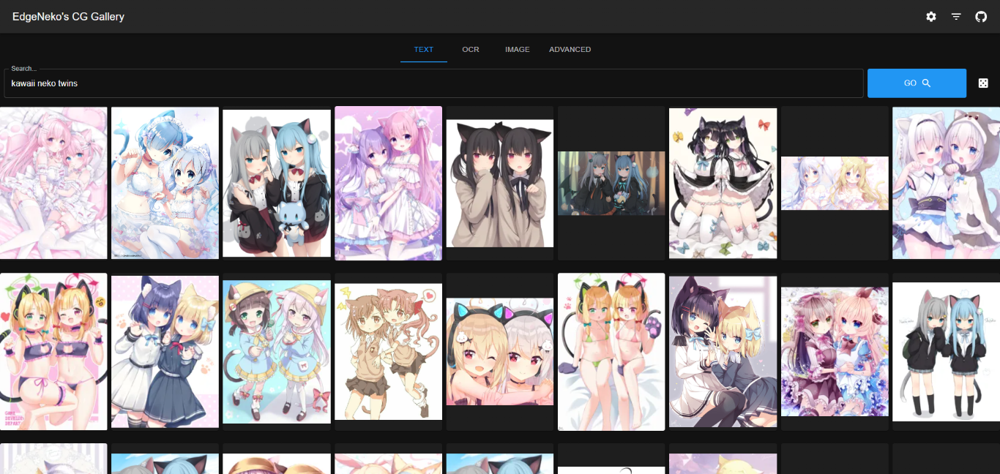
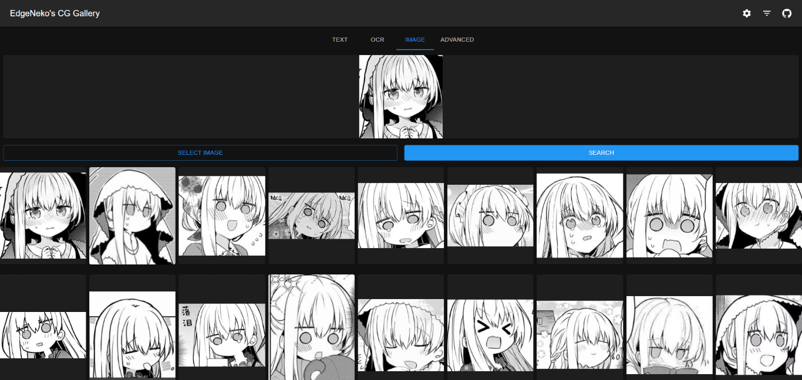
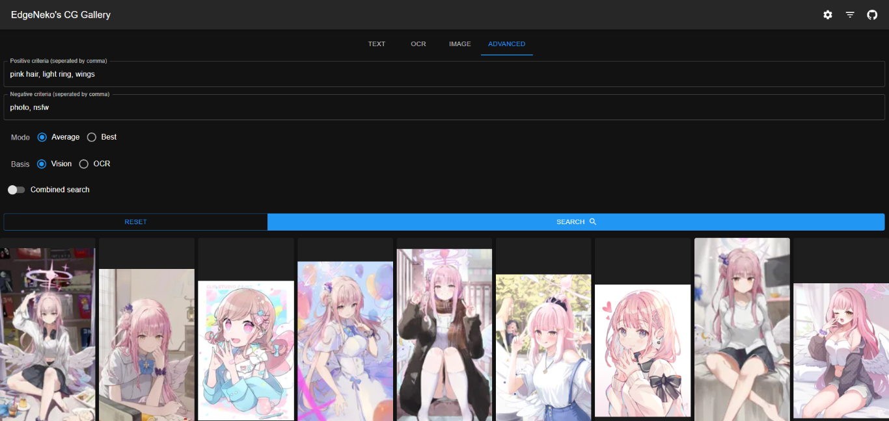

# NekoImageGallery

[](https://github.com/hv0905/NekoImageGallery/actions)
[](https://codecov.io/gh/hv0905/NekoImageGallery)

[](https://hub.docker.com/r/edgeneko/neko-image-gallery)
[](https://deepwiki.com/hv0905/NekoImageGallery)

基于Clip模型与Qdrant向量数据库的在线AI图片搜索引擎。支持关键字搜索以及相似图片搜索。

[English Document](readme.md)

## ✨特性

- 使用Clip模型为每张图片生成768维向量作为搜索依据。无需人工标注或分类，无限分类类别。
- 支持OCR文本搜索，使用PaddleOCR提取图片文本并使用BERT模型生成文本特征向量。
- 使用Qdrant向量数据库进行高效的向量搜索。

## 📷截图








> 以上截图可能包含来自不同画师的版权图片，请不要将其用作其它用途。

## ✈️部署

### 📦 系统要求

#### 硬件要求

| 硬件  | 最低要求                      | 推荐配置                            |
|-----|---------------------------|---------------------------------|
| CPU | X86_64 或 ARM64 处理器，2 核或以上 | 4 核或以上                          |
| 内存  | 4GB 或以上                   | 8GB 或以上                         |
| 存储  | 至少 10GB 用于库、模型和数据         | 50GB 或以上，推荐使用 SSD               |
| GPU | 不需要                       | 支持 CUDA 的 GPU 以加速计算，具有4GB或以上的显存 |

#### 软件要求

- **本地部署**：Python 3.10 ~ Python 3.12, 并且安装[uv包管理器](https://docs.astral.sh/uv/getting-started/installation/)。
- **Docker 部署**：Docker 和 Docker Compose（对于 CUDA 用户，需安装 `nvidia-container-runtime`）或等效的容器运行时

### 🖥️ 本地部署

#### 选择元数据存储方式

NekoImageGallery支持两种元数据存储方式：Qdrant数据库存储与本地文件存储。您可以根据自己的需求选择其中一种方式。

##### Qdrant数据库 （推荐）

在大多数情况下，我们推荐使用Qdrant数据库存储元数据。Qdrant数据库提供了高效的检索性能，灵活的扩展性以及更好的数据安全性。

请根据[Qdrant文档](https://qdrant.tech/documentation/quick-start/)部署Qdrant数据库，推荐使用docker部署。

如果你不想自己部署Qdrant，可以使用[Qdrant官方提供的在线服务](https://qdrant.tech/documentation/cloud/)。

##### 本地文件存储

本地文件存储直接将图片元数据（包括特征向量等）存在本地的Sqlite数据库中。仅建议在小规模部署或开发部署中使用。

本地文件存储不需要额外的数据库部署流程，但是存在以下缺点：

- 本地存储没有对向量进行索引和优化，所有搜索的时间复杂度为`O(n)`，因此若数据规模较大，搜索与索引的性能会下降。
- 使用本地文件存储会使得NekoImageGallery变得有状态，因此会丧失横向扩展能力。
- 当你希望迁移到Qdrant数据库进行存储时，已索引的元数据可能难以直接迁移。

#### 部署NekoImageGallery

> [!NOTE]
> 本教程适用于NekoImageGallery v1.4.0及之后的版本，我们在该版本切换到了`uv`作为包管理器。如果您使用的是早期版本，请参考对应版本标签中的README文件。

1. 将项目目录clone到你自己的PC或服务器中，然后按需checkout到特定版本tag（如`v1.4.0`）。
2. 安装所需依赖：
    ```shell
    uv sync --no-dev --extra cpu # 仅CPU部署

    uv sync --no-dev --extra cu124 # CUDA v12.4 部署

    uv sync --no-dev --extra cu118 # CUDA v11.8 部署
    ```

> [!NOTE]
> - 需要指定`--extra`选项来安装正确的依赖项。如果不指定`--extra`选项，PyTorch及其相关依赖项将不会被安装。
> - 如果您希望使用CUDA加速推理，请务必在此步骤中选择支持CUDA的额外变体（我们建议使用`cu124`，除非您的平台不支持cuda12+）。安装完成后可以使用
    `torch.cuda.is_available()`确认CUDA是否可用。
> - 如果您正在开发或测试，可以在同步时不使用`--no-dev`开关，以安装开发、测试和代码检查所需的依赖项。

3. 按需修改位于`config`目录下的配置文件，您可以直接修改`default.env`，但是建议创建一个名为`local.env`的文件，覆盖
   `default.env`中的配置。
4. (可选) 启用内置前端：
   NekoImageGallery v1.5.0+ 内置了基于 [NekoImageGallery.App](https://github.com/hv0905/NekoImageGallery.App) 的前端应用。
   如需启用，请在配置文件中设置 `APP_WITH_FRONTEND=True`。
   > [!WARNING]
   > 启用内置前端后，所有API将会被自动挂载到`/api`子目录下。例如，原来的`/docs`会变为`/api/docs`。
   > 这可能会影响您现有的部署，请谨慎操作。
5. 运行本应用：
    ```shell
    uv run main.py
    ```
   你可以通过`--host`指定希望绑定到的ip地址(默认为0.0.0.0)，通过`--port`指定希望绑定到的端口(默认为8000)。  
   通过`uv run main.py --help`可以查看所有可用命令和选项。
6. (可选)
   部署前端应用：如果您不希望使用内置的前端，或者希望独立部署前端，可以参照 [NekoImageGallery.App](https://github.com/hv0905/NekoImageGallery.App)
   的[部署文档](https://github.com/hv0905/NekoImageGallery.App)。

### 🐋 Docker 部署

#### 关于Docker镜像

NekoImageGallery镜像发布在DockerHub上，并包含多个变种，设计于在不同的环境使用。

| Tags                                                                                                                                        | 介绍                               | Latest 镜像尺寸                                                                                                                                                                                       |
|---------------------------------------------------------------------------------------------------------------------------------------------|----------------------------------|---------------------------------------------------------------------------------------------------------------------------------------------------------------------------------------------------|
| `edgeneko/neko-image-gallery:<version>`<br>`edgeneko/neko-image-gallery:<version>-cuda`<br>`edgeneko/neko-image-gallery:<version>-cuda12.4` | 基于CUDA12.4, 支持GPU推理的镜像           | [)](https://hub.docker.com/r/edgeneko/neko-image-gallery)              |
| `edgeneko/neko-image-gallery:<version>-cuda11.8`                                                                                            | 基于CUDA11.8, 支持GPU推理的镜像           | [)](https://hub.docker.com/r/edgeneko/neko-image-gallery) |
| `edgeneko/neko-image-gallery:<version>-cpu`                                                                                                 | 仅支持CPU推理的镜像                      | [)](https://hub.docker.com/r/edgeneko/neko-image-gallery)           |
| `edgeneko/neko-image-gallery:<version>-cpu-arm`                                                                                             | (Alpha) 支持ARM64(AArch64)平台的CPU推理 | [)](https://hub.docker.com/r/edgeneko/neko-image-gallery)   |

其中，`<version>`为NekoImageGallery的版本号或版本代称，具体如下：

| Version           | 介绍                                                   |
|-------------------|------------------------------------------------------|
| `latest`          | 最新的稳定版本                                              |
| `v*.*.*` / `v*.*` | 特定版本号(与GitHub Tag对应)                                 |
| `edge`            | 最新的开发版本，与master分支同步更新，可能包含未经完善测试的功能和breaking changes |

在每个镜像中，我们捆绑了必要的依赖项，包括 `openai/clip-vit-large-patch14` 模型权重、`bert-base-chinese`
模型权重和 `easy-paddle-ocr` 模型，以提供一个完整且可直接使用的镜像。

镜像使用 `/opt/NekoImageGallery/static` 作为存储图像文件的卷，如果需要本地存储，可以将其挂载到您自己的卷或目录。

对于配置，我们建议使用环境变量来覆盖默认配置。机密信息（如 API
令牌）可以通过 [docker secrets](https://docs.docker.com/engine/swarm/secrets/) 提供。

> [!NOTE]
> 如需启用内置前端，请设置环境变量 `APP_WITH_FRONTEND=True`。
> 启用后，所有API将会被自动挂载到`/api`子目录下，请确保您的反向代理等配置正确。

#### 准备`nvidia-container-runtime`

如果你希望在推理时支持CUDA加速，请参考[Docker GPU相关文档](https://docs.docker.com/config/containers/resource_constraints/#gpu)
准备支持GPU的容器运行时。

> 相关文档：
> 1. https://docs.docker.com/config/containers/resource_constraints/#gpu
> 2. https://docs.nvidia.com/datacenter/cloud-native/container-toolkit/install-guide.html#docker
> 3. https://nvidia.github.io/nvidia-container-runtime/

#### 运行

1. 下载`docker-compose.yml`文件。
   ```shell
   # For cuda deployment (default)
   wget https://raw.githubusercontent.com/hv0905/NekoImageGallery/master/docker-compose.yml
   # For CPU-only deployment
   wget https://raw.githubusercontent.com/hv0905/NekoImageGallery/master/docker-compose-cpu.yml && mv docker-compose-cpu.yml docker-compose.yml
   ```
2. 按需修改docker-compose.yml文件
3. 运行下面命令启动docker-compose
   ```shell
   # start in foreground
   docker compose up
   # start in background(detached mode)
   docker compose up -d
   ```

### 将图片上传至NekoImageGallery

有几种方法可以将图片上传至NekoImageGallery：

-

通过网页界面：您可以使用内置的网页界面或独立的 [NekoImageGallery.App](https://github.com/hv0905/NekoImageGallery.App)
将图片上传到服务器。请确保您已启用 **Admin API** 并在配置文件中设置了您的 **Admin Token**。
- 通过本地索引：这适用于本地部署或当您想上传的图片已经在服务器上时。
  使用以下命令来索引您的本地图片目录：
  ```shell
   python main.py local-index <path-to-your-image-directory>
  ```
  上述命令将递归地将指定目录及其子目录中的所有图片上传到服务器。
  你可以通过附加选项指定上传的图片的类别和星标状态，具体参考`python main.py local-index --help`。
-

通过API：您可以使用NekoImageGallery提供的上传API来上传图片。通过此方法，可允许服务器本地不保存图片文件而仅仅存储其URL以及元数据。  
请确保您已启用 **Admin API** 并在配置文件中设置了您的 **Admin Token**。  
此方法适用于自动化图片上传或将NekoImageGallery与外部系统进行同步。更多信息请查看 [API文档](#-api文档)。

## 📚 API文档

API文档由FastAPI内置的Swagger UI提供。您可以通过访问服务器的`/docs`或`/redoc`路径来查看API文档。

> [!NOTE]
> 如果您启用了内置前端，API文档的路径将变为`/api/docs`和`/api/redoc`。

## 🐸 其他信息

有关项目的更详细的 Wiki，包括项目的工作原理，您可以访问由 DeepWiki 生成的
Wiki：[NekoImageGallery DeepWiki](https://deepwiki.com/hv0905/NekoImageGallery)。

（该 Wiki 由AI自动生成且未经过项目团队的全面审核，仅供参考。）

## ⚡ 相关项目

以下项目基于NekoImageGallery工作！

[](https://github.com/hv0905/NekoImageGallery.App)
[](https://github.com/pk5ls20/LiteLoaderQQNT-NekoImageGallerySearch)
[](https://github.com/pk5ls20/pk5ls20/nonebot-plugin-nekoimage)

## 📊仓库信息


## ❤️贡献指南

有很多种可以为本项目提供贡献的方式：记录 Bug，提交 Pull Request，报告问题，提出建议等等。

即使您拥有对本仓库的写入权限，您也应该在有需要时创建自己的功能分支并通过 Pull Request 的方式提交您的变更。
这有助于让我们的主仓库保持整洁并使您的个人工作流程不可见。

我们也很感兴趣听到您关于这个项目未来的反馈。您可以通过 Issues 追踪器提交建议或功能请求。为了使这个过程更加有效，我们希望这些内容包含更多信息，以更清晰地定义它们。

## Copyright

Copyright 2025 EdgeNeko

Licensed under AGPLv3 license.
